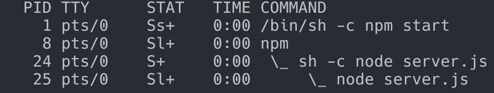
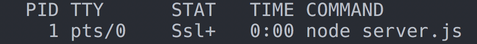

# effective-container-engineering

Practical tips and patterns for building good container citizens


<!-- vim-markdown-toc GFM -->

* [Introduction](#introduction)
* [Process Management](#process-management)
    * [Prefer a single process](#prefer-a-single-process)
        * [References](#references)
    * [Respect Signals](#respect-signals)
* [Configuration](#configuration)
    * [Configure with Environment Variables](#configure-with-environment-variables)
    * [Support Real-Time Configuration with Files](#support-real-time-configuration-with-files)
* [Observability](#observability)
    * [Include Healthchecks](#include-healthchecks)
    * [Know How To Log](#know-how-to-log)
* [Follow 12-Factor Principles](#follow-12-factor-principles)
* [Appendix 1: Setting up a Kubernetes cluster](#appendix-1-setting-up-a-kubernetes-cluster)

<!-- vim-markdown-toc -->

## Introduction

This document contains a set of tips, tricks and suggestions for building software which runs more effectively in containers. Please feel free to submit pull requests for more suggestions!

Some samples in this document require a Kubernetes cluster, there is an example of how to do this in [Appendix 1: Setting up a Kubernetes cluster]().

## Process Management

### Prefer a single process

In general containers should contain a single process. Not being aware of the difference between an exec form and shell form command, or the internals of how your runtime is executing code can lead to an unnecessarily complex process tree.

As an example, check the [`prefer-single-process`](./prefer-single-process) folder. Run the 'bad' container with:

```sh
make run-bad
```

Note that the process tree is unnecessarily messy (try `ps -axf`):



Compare this to the following:

```sh
make run-good
```



A single process means that there's no chance that you will not have your app running as PID 1, which is important as we next in the next point.
 
#### References

Take note of the 'exec form' vs 'shell form' in the following docs:

- [Docker Docs: CMD](https://docs.docker.com/engine/reference/builder/#cmd)
- [Docker Docs: ENTRYPOINT](https://docs.docker.com/engine/reference/builder/#entrypoint)

### Respect Signals

Expect to receive `SIGTERM` from Docker. Expect to receive `SIGINT` from TTY. Handle both, and be explicit you are doing so.

See: [`respect-signals`](./respect-signals) for an example.

By running the deployment in the provided [`./respect-signals/deployment.yml`](./respect-signals/deployments.yml) you can see each service updates quickly. However, changing deployments (for example, by updating the version number) will be *very* slow for containers which don't listen to stop signals.
 
## Configuration

### Configure with Environment Variables

Follow the [12 Factor App]() pattern of configuring your application with environment variables. These are widely supported and understood. They should be your 'default' mode of configuration.

Many systems such as Kubernetes also support treating certain environment variables more carefully, in the form of secrets. Whilst these are not fool-proof, and do not cover cases as sophisticated as secret management systems such as [Hashicorp Vault](TODO), they are often sufficient for basic scenarios.

See: [`configure-with-env-vars`](./configure-with-env-vars) for an example.

Remember:

- You don't necessarily need a fancy config library to handle environment variables!
- If you are handling environment variables yourself, be careful when it comes to types. Env vars are always strings, how missing env vars are handled will depend on your runtime. Don't expect booleans to 'just work'!
- Env vars might be sensitive, if you create a child process, it can inherit them. Be aware of that.
- If configuration is missing, fail fast and fail noisily

### Support Real-Time Configuration with Files

If you need to be able to very rapidly alter the configuration of your program, consider using a configuration file. Then watch the file system for changes. When the file is changed, update the state of your application.

This pattern can be used when you want to update configuration *very quickly*. Environment variables do not support this pattern as they cannot be modified externally once the application has started.

Routers like nginx and haproxy use this pattern to support live reload when their configuration changes.

See: [`configure-with-files`](./configure-with-files) for an example.

Remember:

- This adds a layer of complexity and should be carefully considered before implementing.
- Be very careful with how errors will be handled. Static configuration with environment variables allows a trivial fail-fast pattern. The config file pattern might lead to errors *late* in the server lifecycle.
- State mutation can be tricky. Consider how in-flight requests are handled, race conditions etc.

## Observability

### Include Healthchecks

At the very least, a server should support an explicit healthcheck, to allow monitoring tools to be able to check the status of the server.

See: [`include-healthchecks`](./include-healthchecks) for an example.

Remember:

- You may well want to differentiate between *healthy* and *ready*. Serfers which are not ready might be starting up, or have a backend unavailable, ideally a system should wait for them. Servers which are consistently not healthy should be stopped.
- A 'shallow' healthcheck will check that the component is healthy. A 'deep' healthcheck will check dependent services.
- Healthchecks might offer extra data - uptime, versions of packages, version of the code and so on. But be careful not to inadvertantly expose this data to the outside world.

### Know How To Log

Remember:

- For server applications, you almost certainly will have to log with the context of a request
- Make sure you use correlation ids
- Consider how libraries are going to log, or even if they should
- Log everything, let your logging tool handle stripping out junk

## Follow 12-Factor Principles

Containerised applications should follow the Twelve Factor Principles:

- https://12factor.net/

## Appendix 1: Setting up a Kubernetes cluster

First, install the GCP Cloud SDK. On a Mac, the interactive installer is the easiest way to go:

```sh
curl https://sdk.cloud.google.com | bash
```

Follow the instructions, then restart your shell and initialise your environment:

```sh
exec -l $SHELL
gcloud init
```

For other platforms, and for non-interactive installs, follow the '[Google Cloud SDK Quickstart](https://cloud.google.com/sdk/docs/quickstarts)' guide.

Create a new project to work in, set is as the default, and set a default [zone](https://cloud.google.com/compute/docs/regions-zones/):

```sh
gcloud projects create container-engineering    # you'll need a unique name!
gcloud config set project container-engineering # set the default for now
gcloud config set compute/zone asia-southeast1  # use a zone close to you
```

Now create your cluster:

```sh
gcloud container clusters create container-engineering
```

If you get an 'API not enabled' error, just open the link in the error and hit the 'enable' button on the webpage shown.

When you are done, clean up the cluster with:

```sh
gcloud container clusters delete container-engineering
```
